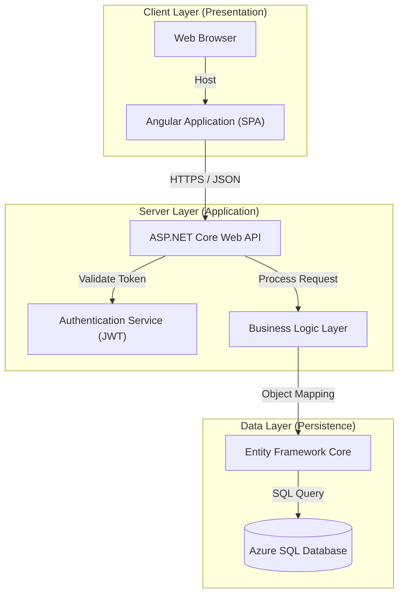
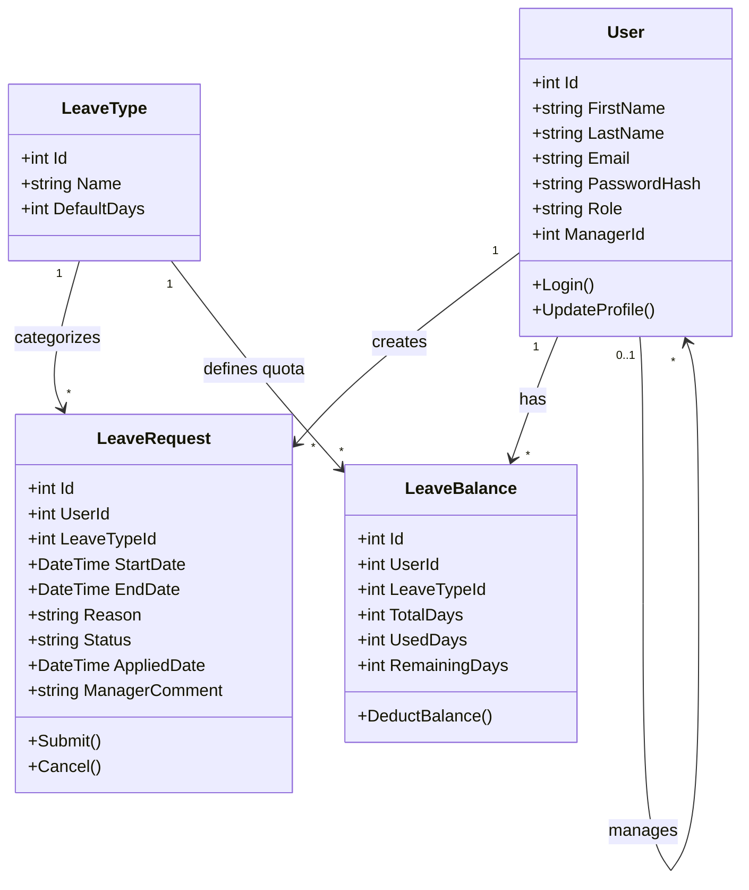
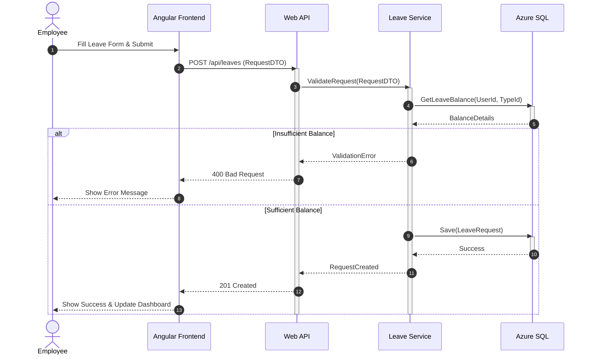
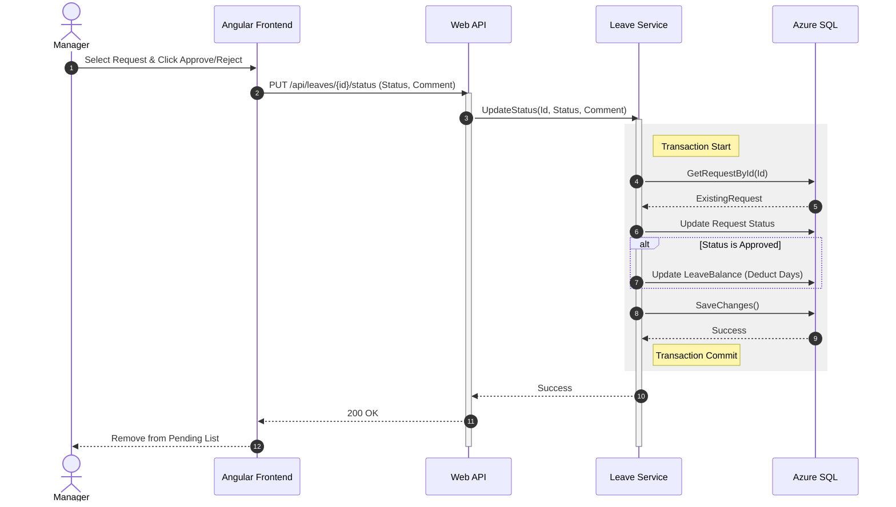
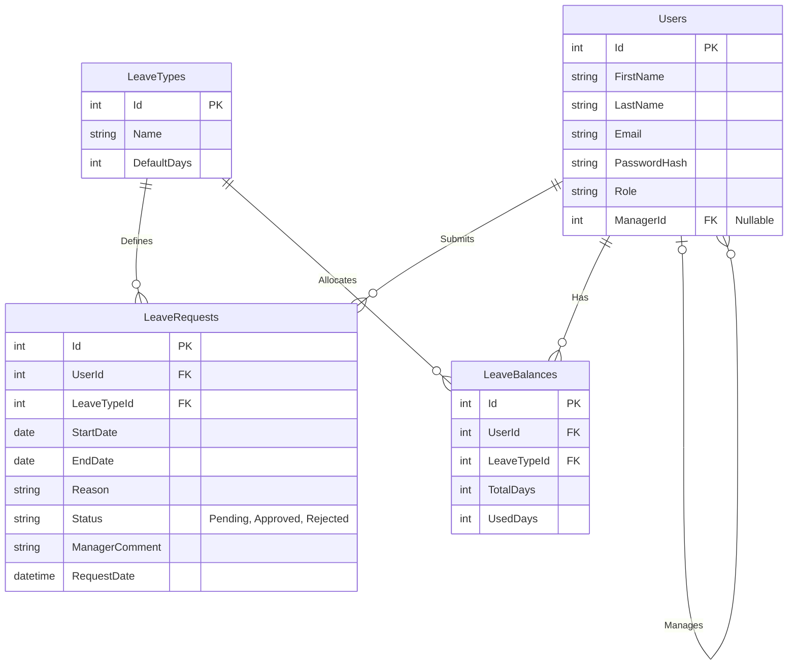

# Smart Leave Management System
## Project Diagrams

### 1. System Architecture Diagram

This diagram illustrates the **3-Tier Architecture** of the application, highlighting the separation between the Client (Presentation), Server (Application), and Data layers.



### 2. Use Case Diagram

This diagram depicts the interactions between the primary actors (**Employee**, **Manager**) and the system's core functionalities.

```mermaid
usecaseDiagram
    actor "Employee" as Emp
    actor "Manager" as Mgr

    package "Smart Leave Management System" {
        usecase "Login" as UC1
        usecase "View Dashboard" as UC2
        usecase "Apply for Leave" as UC3
        usecase "View Leave Status" as UC4
        usecase "View Leave History" as UC5
        usecase "View Leave Balance" as UC6
        
        usecase "View Dashboard" as UC7
        usecase "View Pending Leave Requests" as UC8
        usecase "Approve Leave" as UC9
        usecase "Reject Leave" as UC10
        usecase "View Team Availability" as UC11
    }

    Emp --> UC1
    Emp --> UC2
    Emp --> UC3
    Emp --> UC4
    Emp --> UC5
    Emp --> UC6

    Mgr --> UC1
    Mgr --> UC7
    Mgr --> UC8
    Mgr --> UC9
    Mgr --> UC10
    Mgr --> UC11
```

**Explanation:**
The Use Case Diagram highlights the two primary actors, **Employee** and **Manager**, and their interactions with the **Smart Leave Management System**.
*   **Employee**: Can log in, view their dashboard, apply for leave, and track their leave status, history, and balances.
*   **Manager**: Has elevated privileges to view their own dashboard, manage pending leave requests (Approve/Reject), and monitor team availability.
*   Both actors share the "Login" and "View Dashboard" (though content differs) functionalities.

### 3. Class Diagram

This diagram represents the static structure of the system, showing the key entity classes, their attributes, and relationships.



### 4. Sequence Diagrams

#### 4.1 Apply for Leave (Employee)



#### 4.2 Approve/Reject Leave (Manager)



### 5. Entity Relationship (ER) Diagram

This diagram details the database interactions and schema, focusing on the normalized table structures and foreign key constraints.


